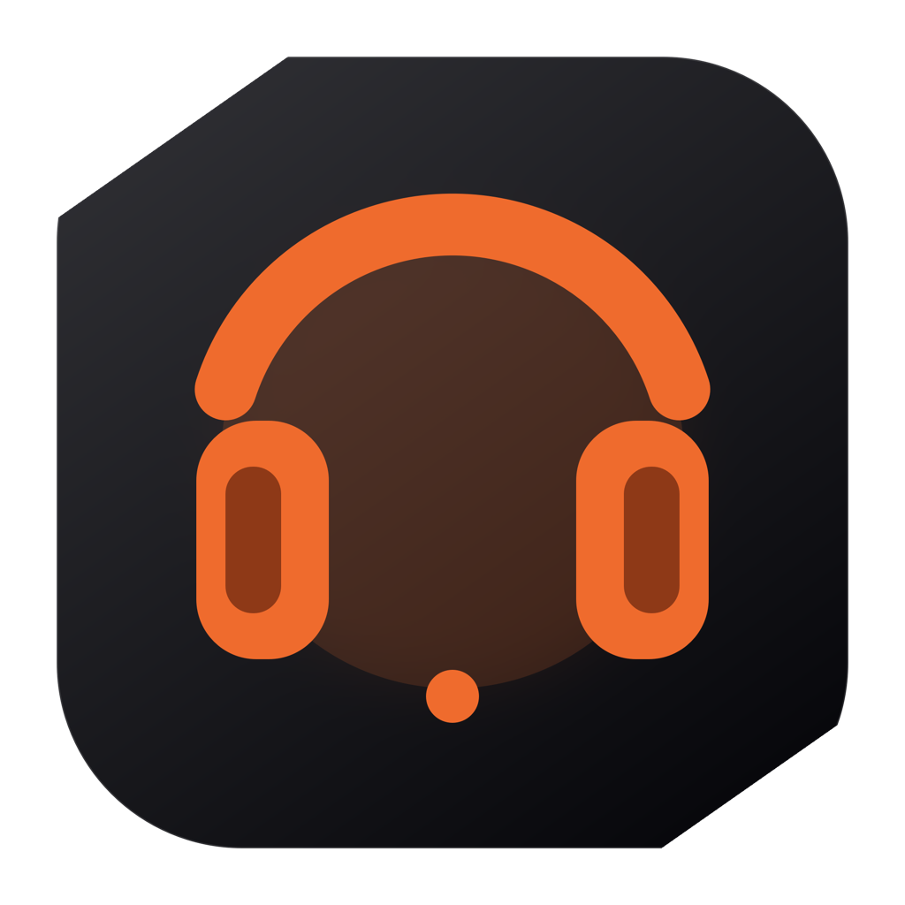
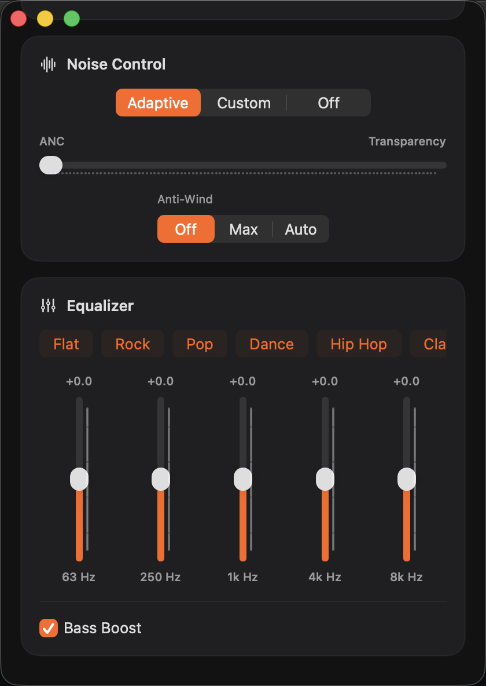
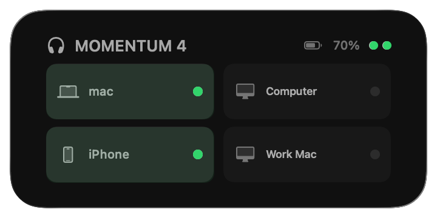

<p align="center">
  
</p>

# M4 Companion

A native macOS companion for managing a Sennheiser MOMENTUM 4 from the desktop: switch multipoint peers, see battery and connection state, adjust noise control and EQ, and use an interactive WidgetKit widget.

> **v0.1.0 Technical Preview** — currently supports **MOMENTUM 4 only**. The downloadable build is ad-hoc signed and not notarized; review the [installation note](#install-from-a-github-release) before running it.

[Download Technical Preview](https://github.com/Zhengyang-Liu/m4-companion/releases/latest) · [Report a bug](https://github.com/Zhengyang-Liu/m4-companion/issues) · [中文速览](#中文速览)

## Screenshots

<table>
  <tr>
    <td align="center"><br><strong>Main app</strong></td>
    <td align="center"><br><strong>Desktop widget</strong></td>
  </tr>
</table>

## Features

- Reads the headset's paired-device list, active connections, multipoint capacity, and battery level.
- Switches the non-Mac multipoint peer with one click while keeping the controlling Mac connected.
- Disconnects a connected non-Mac peer directly.
- Uses bounded connection retries, verifies the resulting state, and attempts to restore the previous peer if a switch fails.
- Offers **Adaptive**, **Custom**, and **Off** noise-control modes.
- Adjusts the ANC-to-transparency level and Anti-Wind mode.
- Provides per-band EQ editing, Flat plus seven five-band presets, and Bass Boost.
- Includes interactive **medium** and **large** WidgetKit widgets for connection status, battery, and peer switching.
- Refreshes state after actions, periodically in the background, and while the main controls are open.
- Starts as a macOS login item after first launch so widget actions can reach the headset.
- Checks for signed updates with Sparkle 2; manual checks are available from **M4 Companion → Check for Updates…**.
- Requires no cloud account; Sparkle contacts only the project's public GitHub Pages feed and GitHub Release download URLs.

## Requirements

- macOS 14 Sonoma or later.
- Apple silicon or Intel Mac (the release app is universal: `arm64` + `x86_64`).
- A Sennheiser MOMENTUM 4 already paired with the Mac over Bluetooth.
- Bluetooth permission for M4 Companion.

Only one matching MOMENTUM 4 should be paired/available to the app at a time. Multiple matching headsets are treated as ambiguous rather than guessed.

## Install from a GitHub Release

1. Download the v0.1.0 Technical Preview disk image from [GitHub Releases](https://github.com/Zhengyang-Liu/m4-companion/releases/latest).
2. Open the disk image and drag **M4 Companion.app** to **Applications**.
3. Launch M4 Companion and allow Bluetooth access when macOS asks.
4. Keep the headphones powered on and connected to this Mac for initial discovery.

### Important: unnotarized Technical Preview

The Technical Preview is **ad-hoc signed but not Apple-notarized**. macOS Gatekeeper may block it even though the app is expected to run after the quarantine flag is removed. Only bypass Gatekeeper if you downloaded the app from this project's release page and accept the risk of running an unnotarized preview.

Try the standard macOS route first:

1. In Finder, Control-click **M4 Companion.app** and choose **Open**.
2. If macOS still blocks it, open **System Settings → Privacy & Security**, find the M4 Companion warning, and choose **Open Anyway**.

If macOS reports that the app is damaged or offers no **Open Anyway** button, remove quarantine from this app only, then launch it:

```bash
xattr -dr com.apple.quarantine "/Applications/M4 Companion.app"
open "/Applications/M4 Companion.app"
```

If you installed it somewhere else, replace the path accordingly. Do **not** remove quarantine recursively from your whole Applications folder.

## Add the desktop widget

Launch M4 Companion once before adding the widget so it can request Bluetooth permission, register its login item, and create an initial local snapshot.

1. Control-click an empty area of the desktop and choose **Edit Widgets** (or open Notification Center and choose **Edit Widgets**).
2. Search for **M4 Companion**.
3. Select the **medium** or **large** size.
4. Click the widget or drag it onto the desktop, then choose **Done**.

Clicking a non-Mac device tile connects or disconnects that peer. Clicking elsewhere opens the full app. Widget data is snapshot-based, so an external change made by another device may take time to appear; opening M4 Companion refreshes it immediately.

## Build from source

### Prerequisites

- Xcode 16.3 or later, with its command-line tools selected (Swift 6.1 toolchain).
- [XcodeGen](https://github.com/yonaskolb/XcodeGen).
- Sparkle 2 is resolved automatically through Swift Package Manager.

```bash
git clone https://github.com/Zhengyang-Liu/m4-companion
cd m4-companion
xcodegen generate
open MomentumDeviceSwitcher.xcodeproj
```

In Xcode:

1. Select the **MomentumDeviceSwitcher** app target, then **Signing & Capabilities**.
2. Enable automatic signing and select **your own Apple Developer team**.
3. Repeat for the **MomentumDeviceWidget** extension target.
4. If Xcode reports identifier conflicts, change both bundle identifiers to values unique to your developer account while preserving the app/extension relationship.
5. Select the **MomentumDeviceSwitcher** scheme and run it on **My Mac**.

You can also build after signing is configured:

```bash
xcodebuild \
  -project MomentumDeviceSwitcher.xcodeproj \
  -scheme MomentumDeviceSwitcher \
  -configuration Debug \
  build
```

Run the local codec/planning and Sparkle configuration checks with:

```bash
swift run CoreTests
python3 scripts/test-sparkle-config.py
```

`MomentumProbe` talks to real paired hardware. Do not run it unless you intend to probe a connected headset.

> `MomentumDeviceSwitcher.xcodeproj` is generated from `project.yml`. Re-run `xcodegen generate` after changing the project specification. Manual project-file changes may be overwritten.

## Architecture

```text
NativeApp (SwiftUI/AppKit host)
  ├── MomentumCore       models, GAIA codecs, switch/control policies
  ├── MomentumBluetooth  IOBluetooth RFCOMM transport and headset client
  └── WidgetExtension    WidgetKit medium/large UI and actions
```

- **MomentumCore** contains protocol framing, validation, connection planning, control models, and recovery policies.
- **MomentumBluetooth** discovers the paired headset and exchanges private GAIA messages over Bluetooth Classic RFCOMM.
- **NativeApp** owns live headset operations, the main SwiftUI controls, login-item behavior, and widget refreshes.
- **WidgetExtension** reads a restricted local snapshot and sends capability-token-protected actions back to the host app through a custom URL scheme.
- The host and widget share only a local JSON snapshot under the current user's Application Support directory.

## Privacy

M4 Companion operates locally. It does not require an account, send telemetry, upload device information, or use a cloud backend. Headset state and paired-device display names are exchanged directly over Bluetooth and cached locally for the widget. The cache is stored with user-only file permissions.

Device names may be sensitive. Remove them from screenshots and logs before posting a bug report.

## Limitations

- **v0.1.0 supports MOMENTUM 4 only.** Other Sennheiser models are not tested or supported.
- This is an early Technical Preview and is neither Developer ID signed nor notarized.
- It relies on a private, undocumented headset protocol that may change with firmware updates.
- The headset must already be paired, powered on, and reachable from the Mac.
- A controlling Mac connection is intentionally preserved; the app will not disconnect itself from the headset.
- More than one matching paired headset is rejected as ambiguous.
- Widget refresh scheduling is controlled partly by macOS and is not guaranteed to be real-time.

## Troubleshooting

### “M4 Companion is damaged” or cannot be opened

Follow the scoped Gatekeeper steps in [Important: unnotarized Technical Preview](#important-unnotarized-technical-preview). Confirm the app is in `/Applications` before using the shown command.

### The headset is not found

- Verify that the MOMENTUM 4 is powered on, paired in **System Settings → Bluetooth**, and connected to this Mac.
- Quit other utilities that may be opening the headset's control channel, then reopen M4 Companion.
- If more than one MOMENTUM 4 is paired, temporarily forget or power off the extra headset.
- Toggle Bluetooth off and on only after saving any work that depends on Bluetooth devices.

### Bluetooth permission was denied

Open **System Settings → Privacy & Security → Bluetooth** and enable M4 Companion, then quit and reopen the app.

### The widget is missing

- Launch the app once from `/Applications`.
- Confirm macOS is 14 or later.
- Reopen **Edit Widgets** and search for **M4 Companion**.
- If you replaced an older build, remove the old widget, launch the new app once, and add the widget again.

### The widget is stale or an action fails

Open M4 Companion to force a live refresh. Make sure the headphones remain connected to the Mac and that the M4 Companion login item is allowed in **System Settings → General → Login Items & Extensions**.

### A switch did not complete

The target device may be asleep, out of range, or refusing a connection. M4 Companion retries for a bounded period and attempts rollback. Reconnect the previous peer manually if the headset cannot confirm the restored state.

## Roadmap

- Broader firmware validation and clearer compatibility reporting.
- Signed and notarized release builds.
- Better diagnostics and exportable, privacy-scrubbed troubleshooting information.
- More widget status detail and refresh controls where macOS permits them.
- Additional headset models only after protocol behavior is independently verified and safely tested.

Roadmap items are intentions, not commitments.

## 中文速览

M4 Companion 是一个面向 macOS 14+ 的 MOMENTUM 4 非官方桌面工具，可切换双设备连接、查看电量、调节降噪/通透/EQ，并提供中号与大号桌面小组件。v0.1.0 是未公证的技术预览版；安装前请阅读[安装与 Gatekeeper 说明](#install-from-a-github-release)。目前仅支持 MOMENTUM 4，所有通信和缓存均在本机完成，不需要账号或云服务。

## Contributing and security

Contributions are welcome; see [CONTRIBUTING.md](CONTRIBUTING.md). Please report vulnerabilities according to [SECURITY.md](SECURITY.md), not in a public issue.

## Acknowledgements

This project was made possible by careful observation, testing, and independent reverse engineering of the headset's Bluetooth control behavior, together with protocol knowledge shared by the wider audio and Bluetooth communities. Thanks also to the maintainers of XcodeGen and to contributors who test cautiously across macOS and firmware versions.

The app embeds [Sparkle 2](https://sparkle-project.org/) for signed software updates. Headset control and local caching use Apple system frameworks and do not require an account or cloud backend.

## Trademark disclaimer

M4 Companion is an independent, unofficial project. It is not affiliated with, authorized by, endorsed by, or supported by Sennheiser electronic GmbH & Co. KG, Sonova AG, or their affiliates. **Sennheiser**, **MOMENTUM**, and related marks are trademarks of their respective owners. Their use here is solely to identify compatible products.

## License

Released under the [MIT License](LICENSE).
